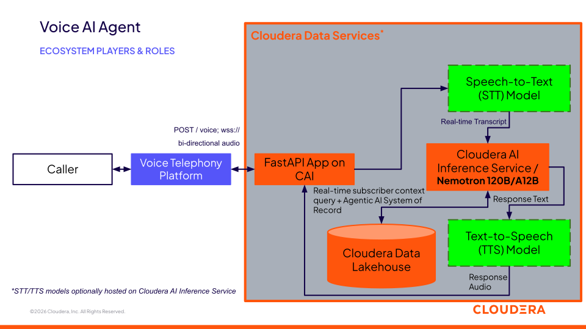

# Telecom Voice AI Agent Demo

[](LICENSE)
[](requirements.txt)
[](.project-metadata.yaml)
[](https://github.com/athpra/voice-ai/stargazers)
[](https://github.com/athpra/voice-ai/network/members)
[](https://github.com/athpra/voice-ai/watchers)

## Table of Contents

- [Overview](#overview)
- [Demo](#demo)
- [Use Case](#use-case)
- [Key Features](#key-features)
- [Quickstart](#quickstart)
- [Architecture / Software Components](#architecture--software-components)
- [Target Audience](#target-audience)
- [Repository Structure](#repository-structure)
- [Prerequisites](#prerequisites)
- [Hardware Requirements](#hardware-requirements)
- [Documentation](#documentation)
- [License](#license)
- [Disclaimer](#disclaimer)

## Overview

A real-time voice AI agent for phone-based customer support: a caller dials
a phone number, their speech is transcribed live, enriched with their
account context, sent to an LLM served by Cloudera AI Inference Service, and
the reply is spoken back to them — end to end, orchestrated by a single
[CML Application](https://docs.cloudera.com/machine-learning/cloud/applications/topics/ml-applications.html).
It's built to show how Cloudera AI Inference Service slots into a live,
latency-sensitive conversational pipeline alongside third-party telephony,
speech-to-text, and text-to-speech services. The speech and telephony stack
shown (Twilio, Deepgram, Cartesia) is one example wiring, not a requirement —
the pattern works with any TTS/STT vendor you already use or are evaluating;
the constant is Cloudera AI Inference Service driving the conversation.

## Demo

No recorded Reprise walkthrough yet — TODO once one is produced.

In the meantime, the app ships its own live demo: the `/dashboard` page
lights up in real time as a call moves through Twilio → STT → LLM → TTS, and
its "simulate" trigger (`POST /dashboard/simulate`) plays a canned call
through that same dashboard with no Twilio call required, for rehearsing
without live credentials.

## Use Case

Phone support is still the primary contact channel for many telecom
customers, and live agent capacity is expensive to scale. This blueprint
shows a pattern for automating first-line phone support — greeting the
caller by name, answering account questions (data usage, billing, plan
options) using their real account context, and handing off gracefully —
without requiring the caller to use an app, chatbot widget, or IVR menu
tree. The same pattern generalizes to any inbound-call support use case
beyond telecom.

## Key Features

- **Not locked to any specific TTS/STT vendor.** There are many
  speech-to-text and text-to-speech products on the market, and this
  blueprint doesn't compete with them or depend on a particular one — it
  demonstrates a pattern for wiring *any* TTS/STT provider into Cloudera AI
  Inference Service. Speech-to-text already swaps between Deepgram, Cartesia,
  or a Cloudera-hosted Whisper/Riva model via one config value; TTS ships
  with a Cartesia implementation behind the same kind of interface. Both are
  reference examples to adapt, not requirements.
- **Real-time, bidirectional phone call handling** over a telephony
  provider's streaming media API (Twilio in this reference implementation)
  — no separate telephony infrastructure to stand up.
- **LLM responses grounded in caller account context**, generated by
  Cloudera AI Inference Service, including support for reasoning models
  (with thinking-suppression and scratch-reasoning filtering built in — see
  [`docs/architecture.md`](docs/architecture.md)).
- **Live visual call-pipeline dashboard** for demos, showing each stage of
  the pipeline lighting up as a real call happens.
- **Swappable data layer**: caller context comes from a mock telecom
  customer dataset behind a single lookup function, ready to be pointed at a
  real CRM/billing system.

## Quickstart

```bash
git clone <this-repo>
cd voice-ai-agent
python -m venv .venv && source .venv/bin/activate
pip install -r requirements-dev.txt
python scripts/seed_customer_data.py
cp .env.example .env   # fill in your API keys
uvicorn app.main:app --reload --port 8090
```

That gets the app running locally against real STT/TTS/LLM APIs. To take a
real phone call end to end (tunneling, Twilio webhook config, or a full CML
deployment), see [`docs/setup.md`](docs/setup.md) and
[`deploy/cml-deployment.md`](deploy/cml-deployment.md).

## Architecture / Software Components



A telephony provider (Twilio in this reference implementation) handles the
PSTN call and streams audio to this app's FastAPI Application over a
websocket. The app looks up the caller, streams their speech to an STT
provider, sends the transcript plus account context to an LLM on Cloudera AI
Inference Service, and speaks the reply back through a TTS provider
(Cartesia by default). By default only the telephony, STT, and TTS legs are
external services — the call orchestration and the LLM both run inside your
Cloudera AI workbench. None of the three vendors shown are architecturally
required: STT and TTS already sit behind swappable provider interfaces, and
[`docs/architecture.md`](docs/architecture.md) covers what swapping the
telephony provider itself would take.

## Target Audience

- Solutions engineers demoing Cloudera AI Inference Service in a live,
  latency-sensitive conversational scenario.
- ML/platform engineers evaluating how Cloudera AI Inference Service
  integrates alongside third-party speech APIs.
- Developers building or adapting a phone-based voice AI agent.

## Repository Structure

| Path | Description |
| --- | --- |
| `app/` | FastAPI application: call orchestration, STT/TTS/LLM provider integrations, mock data layer |
| `assets/` | Architecture diagram |
| `deploy/` | CML deployment guide (the actual deploy descriptor, `.project-metadata.yaml`, stays at repo root — CML reads it there) |
| `docs/` | Extended documentation: architecture detail, setup, verification status |
| `scripts/` | CML bootstrap tasks (install deps, seed mock data) and a local call-simulation harness |
| `tests/` | Unit tests |
| `METADATA.yaml` | Catalog metadata for the Cloudera blueprint website |
| `.project-metadata.yaml` | CML AMP spec (env vars + tasks) for one-import deployment |
| `run_app.py` | CML Application entrypoint (uvicorn on `$CDSW_APP_PORT`) |

## Prerequisites

- A Cloudera AI (CML) workspace with Cloudera AI Inference Service access,
  and an LLM (instruct or reasoning model) deployed as an endpoint there.
- A telephony provider account capable of streaming call audio over a
  websocket. This repo is wired up against
  [Twilio](https://console.twilio.com) (voice-capable phone number) as a
  reference example.
- STT and TTS provider accounts of your choice. This repo ships wired up
  against [Deepgram](https://console.deepgram.com) (default STT) and
  [Cartesia](https://play.cartesia.ai) (TTS, and optionally STT) as reference
  examples — any other STT/TTS vendor works the same way behind the
  `STTProvider`/`TTSProvider` interfaces (see
  [`docs/architecture.md`](docs/architecture.md)).
- git and Python 3.10+ for local development.

## Hardware Requirements

| Deployment | Minimum |
| --- | --- |
| Launchable / demo (this CML Application + its bootstrap tasks) | 2 CPU, 4 GB RAM for the Application; 1 CPU, 2 GB RAM per bootstrap task |
| Production / enterprise | Same as above for this app -- it does no local inference. The LLM's own Cloudera AI Inference Service endpoint sizing (CPU/GPU/memory) depends entirely on the model deployed there. |

This app has no local speaker/microphone requirement — the call audio flows
through Twilio's PSTN connection, not the machine running CML. See
[`deploy/cml-deployment.md`](deploy/cml-deployment.md#hardware-sizing) for
the full breakdown.

## Documentation

- [`docs/architecture.md`](docs/architecture.md) — full call flow, project
  layout, STT provider tradeoffs, reasoning-model handling
- [`docs/setup.md`](docs/setup.md) — external service setup and local
  development
- [`docs/verification.md`](docs/verification.md) — what's been verified,
  what still needs live credentials, known v1 limitations
- [`deploy/cml-deployment.md`](deploy/cml-deployment.md) — CML deployment
  steps and hardware sizing
- [CML Applications documentation](https://docs.cloudera.com/machine-learning/cloud/applications/topics/ml-applications.html)

## License

Copyright 2026 Cloudera, Inc.

Licensed under the Apache License, Version 2.0. See [`LICENSE`](LICENSE).

## Disclaimer

*This blueprint is intended for Proof-of-Concept and research use only. It is not designed for production deployment. Use in production environments is at the user's own risk. The authors and contributors accept no liability for operational impacts or damages.*
